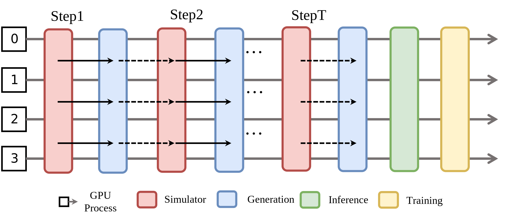

Collocated
=================

All tasks are scheduled on the *same* set of GPUs.  During any stage
only one task type runs and occupies the entire device pool until that
stage finishes.

**Pros**

* Simplest design; no complex data-dependency management.

**Cons**

* Heavy parameter sharding overhead.  
* Long-tail latency in the rollout stage extends total training time.
