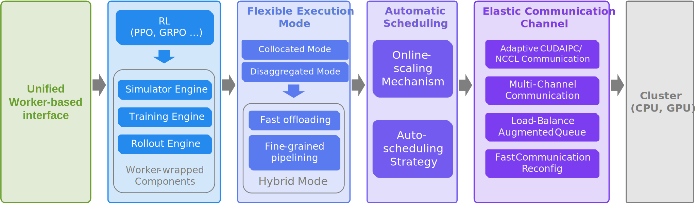

Welcome to **RLinf**!
=====================

RLinf is a flexible and scalable open-source infrastructure designed for post-training foundation models via reinforcement learning. The 'inf' in RLinf stands for Infrastructure, highlighting its role as a robust backbone for next-generation training. It also stands for Infinite, symbolizing the system’s support for open-ended learning, continuous generalization, and limitless possibilities in intelligence development.

.. Centered on Agentic Reinforcement Learning, RLinf supports the training and evaluation of next-generation agents by unlocking scalable compute, unifying mainstream frameworks, and streamlining the end-to-end workflow—making RL post-training accessible to everyone.

.. * Related publication : `PAPER TITLE <TODO>`_
.. * Source code : `GitHub repository <TODO>`_

----------------

----------------

**RLinf is unique with:**

- Embodied Agent Support
- Fast adaptation support for mainstream VLA models: `OpenVLA`_, `OpenVLA-OFT`_, `π₀`_
- Support for mainstream CPU & GPU-based simulators via standardized RL interfaces: `ManiSkill3`_, `LIBERO`_
- Enabling the first RL fine-tuning of the π₀ model family with a flow-matching action expert.

**RLinf is fast with:**

- Online Scaling Strategy: dynamically scales training resources, with GPU switching performed within seconds.
- Auto-scheduling Strategy: automatically selects the most suitable execution mode based on the training workload.
- Improves efficiency by 20-40% while preserving the on-policy property of RL algorithms.

**RLinf is flexible and easy to use with:**

- Flexible Execution Modes

  - Collocated mode: shares all GPUs across all workers.
  - Disaggregated mode: enables fine-grained pipelining.
  - Hybrid mode: combines collocated and disaggregated modes—specially designed for agent training in embodied intelligence.

- Multiple Backend Integrations

  - A single unified interface drives two complementary backends, allowing seamless switching without code changes.
  - FSDP + Hugging Face: rapid adaptation to new models and algorithms, ideal for beginners and fast prototyping.
  - Megatron + SGLang: optimized for large-scale training, delivering maximum efficiency for expert users with demanding workloads.

- Built-in support for popular RL methods, including PPO, GRPO, DAPO, Reinforce++, and more.

.. _OpenVLA: https://github.com/openvla/openvla
.. _OpenVLA-OFT: https://github.com/moojink/openvla-oft
.. _IsaacLab: https://github.com/isaac-sim/IsaacLab
.. _ManiSkill3: https://github.com/haosulab/ManiSkill
.. _LIBERO: https://github.com/Lifelong-Robot-Learning/LIBERO
.. _π₀: https://github.com/Physical-Intelligence/openpi
.. _Megatron-LM: https://github.com/NVIDIA/Megatron-LM
.. _SGLang: https://github.com/sgl-project/sglang
.. _vLLM: https://github.com/vllm-project/vllm

--------------------------------------------

.. toctree::
  :maxdepth: 2
  :includehidden:
  :titlesonly:

  rst_source/start/index

--------------------------------------------

.. toctree::
  :maxdepth: 3
  :includehidden:
  :titlesonly:

  rst_source/tutorials/index

--------------------------------------------

.. toctree::
  :maxdepth: 2
  :includehidden:
  :titlesonly:

  rst_source/examples/index

--------------------------------------------

.. toctree::
  :maxdepth: 2
  :includehidden:
  :titlesonly:

  rst_source/blog/index

--------------------------------------------

.. toctree::
  :maxdepth: 2
  :includehidden:
  :titlesonly:

  rst_source/apis/index

--------------------------------------------

.. toctree::
  :maxdepth: 1
  :includehidden:
  :titlesonly:

  rst_source/faq

--------------------------------------------

Contribution Guidelines
~~~~~~~~~~~~~~~~~~~~~~~~~

Great! We are always on the lookout for more contributors to our code base.

Firstly, if you are unsure or afraid of anything, just ask or submit the issue or pull request anyways. You won't be yelled at for giving your best effort. The worst that can happen is that you'll be politely asked to change something. We appreciate any sort of contributions and don't want a wall of rules to get in the way of that.

However, for those individuals who want a bit more guidance on the best way to contribute to the project, read on. This document will cover all the points we're looking for in your contributions, raising your chances of quickly merging or addressing your contributions.

There are a few simple guidelines that you need to follow before providing your hacks.