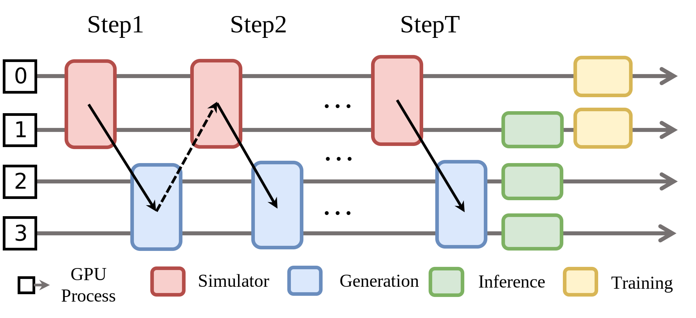

Disaggregated
==================================

Different RL tasks are mapped to different GPU groups according to their
compute needs.

**Pros**

* Partial concurrency between tasks.  
* Flexible GPU allocation.  
* No parameter sharding → lower communication cost.

**Cons**

* Data-flow dependencies leave many GPUs idle.  
* Insufficient GPU resources for the training stage.