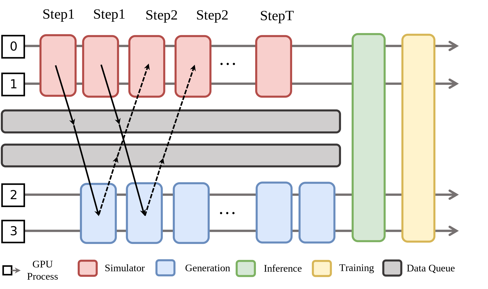

Hybrid 
=================

RLinf combines the strengths of both schemes in a **hybrid** topology:
you can choose which tasks are *shared* and which are *isolated*.

In the embodied setting (see diagram above), 
the simulation and generation stages run on separate GPU pools but share resources with the inference and training stages. 
Two *data queues* decouple producer and consumer rates, 
helping to smooth the pipeline, balance the load, and virtually eliminate performance bottlenecks.
To further mitigate memory pressure, 
the training stage retains access to all GPUs, while simulation and generation operate unsharded.

**Pros**

* Zero sharding overhead in the generation stage.  
* Nearly zero bubble during generation stage.  
* Empirically doubles rollout throughput versus classic disaggregated mode.
